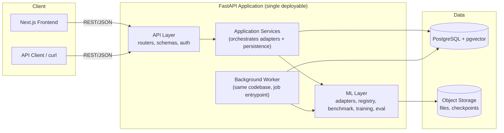
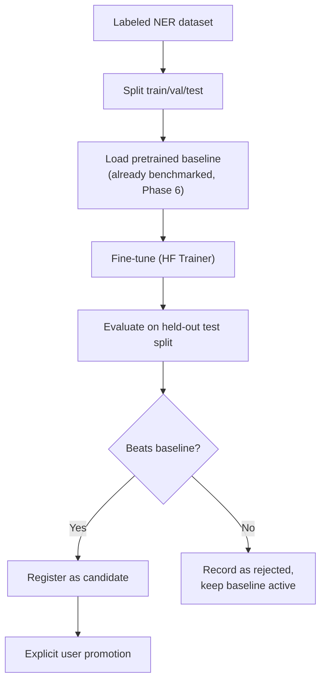
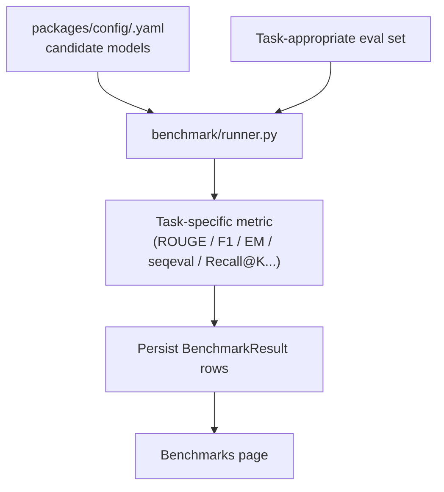
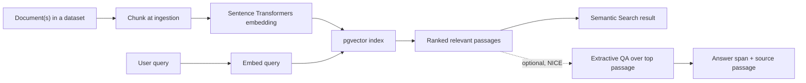
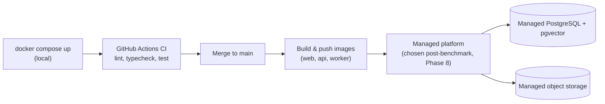

# OmniText — Architecture (v3, Final)

| | |
|---|---|
| **Document owner** | Engineering |
| **Status** | Final — v3.0 |
| **Implements** | `PRD.md` v3.0 |
| **Related documents** | `Rules.md`, `Phases.md`, `Design.md`, `DECISIONS.md`, `Memory.md` |

---

## 1. Architectural Overview

OmniText is a **modular monolith**: one Next.js frontend, one FastAPI backend process (plus a background worker process for long-running jobs), one PostgreSQL database (with pgvector for embeddings), and object storage for files. No microservices, no message broker, no separate services beyond what's needed to run background jobs without blocking request threads. This is sized to the actual requirement — seven NLP tasks, one fine-tuning workflow, one developer — not to look like a distributed system.



### 1.1 Why a modular monolith (not microservices)

One developer, seven tasks, no independent-scaling requirement between components — splitting this into services would add deployment surfaces and network failure modes without solving a real problem. Internal modularity (adapters, service layer, clear module boundaries) gets the maintainability benefit of separation without the operational cost of separation. Full reasoning in `DECISIONS.md`.

### 1.2 Deployment-aware, provider-agnostic

The architecture assumes: CPU inference as the default (GPU only if benchmarking in Phase 6 proves it's needed for a specific task), externalized config via environment variables, a stateless application process that can restart cleanly, and persistent state living only in Postgres and object storage. This makes the eventual choice of hosting provider (`PRD.md` §13) a configuration decision, not an architectural one.

---

## 2. Folder Structure

```
omnitext/
├── apps/
│   ├── web/                         # Next.js frontend
│   │   ├── app/
│   │   │   ├── (marketing)/         # Home / quick-analysis landing
│   │   │   ├── (dashboard)/
│   │   │   │   ├── analyze/
│   │   │   │   ├── documents/       # datasets + documents
│   │   │   │   ├── search/          # semantic search + QA
│   │   │   │   ├── benchmarks/
│   │   │   │   ├── experiments/
│   │   │   │   └── settings/
│   │   │   └── (auth)/
│   │   ├── components/
│   │   │   ├── ui/                  # shadcn/ui primitives
│   │   │   ├── nlp/                 # one result renderer per task
│   │   │   └── layout/
│   │   ├── lib/
│   │   │   ├── api-client.ts
│   │   │   └── hooks/
│   │   └── types/                   # generated from OpenAPI
│   │
│   └── api/                         # FastAPI backend
│       ├── omnitext/
│       │   ├── main.py
│       │   ├── api/v1/
│       │   │   ├── routers/
│       │   │   │   ├── auth.py
│       │   │   │   ├── documents.py     # datasets + documents
│       │   │   │   ├── analyses.py      # single/multi-task run resource
│       │   │   │   ├── search.py        # semantic search + QA
│       │   │   │   ├── benchmarks.py
│       │   │   │   ├── experiments.py
│       │   │   │   └── models.py        # registry read endpoints
│       │   │   ├── schemas/
│       │   │   └── deps.py              # DB session, current_user, ownership checks
│       │   ├── services/                # application/business logic layer
│       │   │   ├── analysis_service.py
│       │   │   ├── document_service.py
│       │   │   ├── search_service.py
│       │   │   └── job_service.py       # background job dispatch/status
│       │   ├── ml/
│       │   │   ├── adapters/
│       │   │   │   ├── base.py
│       │   │   │   ├── summarization.py
│       │   │   │   ├── sentiment.py
│       │   │   │   ├── ner.py
│       │   │   │   ├── classification.py
│       │   │   │   ├── keyword_extraction.py
│       │   │   │   ├── semantic_search.py
│       │   │   │   └── question_answering.py
│       │   │   ├── registry/
│       │   │   ├── benchmark/
│       │   │   ├── training/            # ner_finetune.py only
│       │   │   ├── evaluation/
│       │   │   ├── chunking/            # task-aware long-document handling
│       │   │   └── embeddings/
│       │   ├── db/
│       │   │   ├── models/
│       │   │   ├── migrations/
│       │   │   └── session.py
│       │   ├── storage/
│       │   │   └── object_store.py
│       │   ├── core/
│       │   │   ├── config.py
│       │   │   ├── logging.py
│       │   │   └── security.py          # password hashing, API key handling
│       │   └── worker/
│       │       └── main.py              # background job entrypoint
│       ├── tests/
│       └── scripts/
│           ├── run_benchmark.py
│           └── run_finetune.py
│
├── packages/config/                  # task/model config (YAML)
├── infra/
│   ├── docker/ (api.Dockerfile, web.Dockerfile, worker.Dockerfile)
│   └── docker-compose.yml
├── docs/
└── .github/workflows/
```

### 2.1 Directory Rationale (what changed from the old 10-task design)

- Collapsed per-task routers into `analyses` (single/multi-task run) and `search` (semantic search + QA together, since they share the retrieval concept) — fewer routers, matching the leaner 7-task scope.
- Added `services/` explicitly as the application logic layer between API and ML — this is where ownership/authorization checks and orchestration live, so routers stay thin and adapters stay ML-only.
- Added `ml/chunking/` as its own module — long-document handling is a real, task-specific requirement (`PRD.md` §14), not something scattered inline per adapter.
- No `orchestration/job_queue.py` abstraction layer — `services/job_service.py` dispatches background work directly to the worker process via a simple Postgres-backed jobs table; no framework-level queue abstraction because there's no plan to swap it.

---

## 3. Frontend Architecture

Stack: Next.js (App Router), React, TypeScript, Tailwind, shadcn/ui, Framer Motion (state-transition use only), TanStack Query for all server state.

- **Route groups:** `(marketing)` is the no-login Quick Analysis landing page — the actual front door of the product (`PRD.md` FR-01), covering the five single-document tasks (Summarization, Sentiment, NER, Classification, Keyword Extraction). `(dashboard)` holds account-gated sections: Analyze (saved-history version), Documents, Search, Benchmarks, Experiments, Settings. `(auth)` for login/register.
- **Quick Analysis is a first-class, ungated route** — it does not live behind the dashboard shell, and does not require any API calls that assume a logged-in user. Semantic Search and Extractive QA are deliberately **not** part of Quick Analysis: both need a document/context rather than a single pasted string, so they live under the `search/` Document Intelligence route instead (`PRD.md` §8.1). That route accepts context supplied directly (e.g., a pasted passage for QA) without requiring an account; an account is only required to persist a dataset across sessions.
- Types generated from the backend's OpenAPI schema; no hand-maintained duplicate types.
- `components/nlp/` holds one result renderer per task (`SummaryView`, `SentimentBadge`, `NerHighlightView`, `ClassificationBars`, `KeywordList`, `SemanticSearchResults`, `QaAnswerCard`) — composed by whichever page ran the analysis.

## 4. Backend Architecture

### 4.1 API Layer
Versioned under `/api/v1`. Routers are resource-oriented: `auth`, `documents` (datasets + files), `analyses` (runs one or more of the five single-document tasks), `search` (semantic search + extractive QA, since both operate over a dataset/document), `benchmarks`, `experiments`, `models`. Every router's data-touching endpoints depend on `deps.py`'s `current_user` + an ownership check helper — this is where FR-71's isolation requirement is enforced, once, not reimplemented per router.

### 4.2 Application Services Layer
`services/` holds the actual business logic: given a request and the authenticated user, decide what to do, call the right adapter(s), persist the result, return it. Routers call services; services call the ML layer. This is the layer that didn't exist explicitly in the old "orchestration" design and is now where authorization-aware logic actually lives.

### 4.3 ML Layer
Task adapters, model registry, benchmark runner, the NER training pipeline, the shared evaluator, and the chunking module. Detailed in §6–§9.

## 5. Response Envelope & Error Handling

```json
{
  "data": { "...task-specific result..." },
  "meta": { "model_id": "ner-bert-base-v1.0", "latency_ms": 142, "request_id": "..." },
  "error": null
}
```

Used on every endpoint including error responses (`data: null`, `error` populated with a specific code/message — never a raw exception).

---

## 6. ML Architecture — Task Adapters

```python
class TaskAdapter(Protocol):
    task_name: str
    def load(self, model_ref: ModelRef) -> None: ...
    def predict(self, input: TaskInput) -> TaskOutput: ...
    def batch_predict(self, inputs: list[TaskInput]) -> list[TaskOutput]: ...
```

Seven adapters implement this: `summarization`, `sentiment`, `ner`, `classification`, `keyword_extraction`, `semantic_search`, `question_answering`. Models load once per process and are cached — no per-request reload. Adding an eighth task later (from the Future Roadmap list) means one new adapter file + one config entry — no other layer changes.

## 7. Long-Document Handling (Chunking)

`ml/chunking/` implements per-task strategies, selected by the adapter based on task semantics:

| Task | Strategy |
|---|---|
| Summarization | Chunk → summarize each chunk → summarize the combined chunk-summaries |
| Sentiment / Classification | Chunk → predict per chunk → aggregate (majority/weighted by chunk length) |
| NER | Chunk with overlap → predict per chunk → merge entity spans, dedupe at chunk boundaries |
| Keyword Extraction | Chunk → extract per chunk → merge/re-rank combined candidates |
| Semantic Search | Documents chunked at ingestion time (embedding granularity), not at query time |
| Extractive QA | If context exceeds the model's limit, the system either narrows context via a search step first (advanced/NICE workflow) or informs the user the context is too long for direct QA — never silently truncates the context out from under the question |

## 8. Training Pipeline (NER Fine-Tuning)



Entrypoint `scripts/run_finetune.py`, invoked by the worker process for the actual run. Every run writes a complete `Experiment` row before any registry mutation. Promotion is a separate, explicit action (FR-44) — never automatic.

## 9. Benchmark Pipeline



Metric choice per task is fixed in `PRD.md` §9 and implemented once in `ml/evaluation/evaluator.py`, shared with the training pipeline so a fine-tuned NER model's numbers are directly comparable to its benchmarked baseline.

## 10. Semantic Search & QA Flow



## 11. Authentication & Authorization Flow

- Password auth issues a session; API key auth issues a bearer token — both resolve to the same `current_user` dependency.
- Every data-touching endpoint calls an ownership check (`deps.py`) before the service layer runs: does this `dataset_id`/`document_id`/`analysis_id`/`experiment_id` belong to `current_user`? If not, `404` (not `403`, to avoid confirming resource existence to a non-owner).
- This check is implemented once and reused — not re-derived per router (`Rules.md` will enforce this as a standard, not a convention).

## 12. Storage

| Data | Store |
|---|---|
| Users, datasets, documents (metadata), analyses, results, experiments, benchmark results, registry | PostgreSQL |
| Embeddings + similarity index | pgvector extension in the same PostgreSQL instance |
| Raw uploaded files, fine-tuned checkpoints | Object storage (S3-compatible; local-filesystem-backed in dev via the same interface) |

No separate vector database, no separate experiment tracker — Postgres covers the real requirement at this scale (`DECISIONS.md`).

## 13. Background Processing

A `jobs` table in Postgres (`id`, `type`, `status`, `payload`, `result`, timestamps) backs three job types: dataset embedding, benchmark runs, fine-tuning runs. The API enqueues a row; the worker process (`worker/main.py`, same codebase, different entrypoint) polls and executes, updating status. No Redis, no Celery — this is the simplest mechanism that reliably handles genuinely expensive work without blocking request threads, and it's honestly sized to the actual job volume (`DECISIONS.md`).

## 14. Deployment Architecture



Three images (`web`, `api`, `worker`), CPU inference by default. The specific managed platform (frontend hosting + container platform + managed Postgres) is selected in Phase 8, after real latency/memory numbers exist from Phase 6 benchmarking — the architecture doesn't need to know the provider in advance, only that it needs: container hosting, a managed Postgres with pgvector support, object storage, and environment-variable-based config.

## 15. CI/CD

- **CI:** lint, typecheck, unit + integration tests, a benchmark smoke run (tiny fixture models) on every PR.
- **CD:** build and push tagged images on merge to `main`; deploy step documented and initially manually triggered, automatable later without changing the build step.

---

*Next document: `Rules.md` — engineering standards for this exact architecture, including the non-negotiable authorization rule.*
